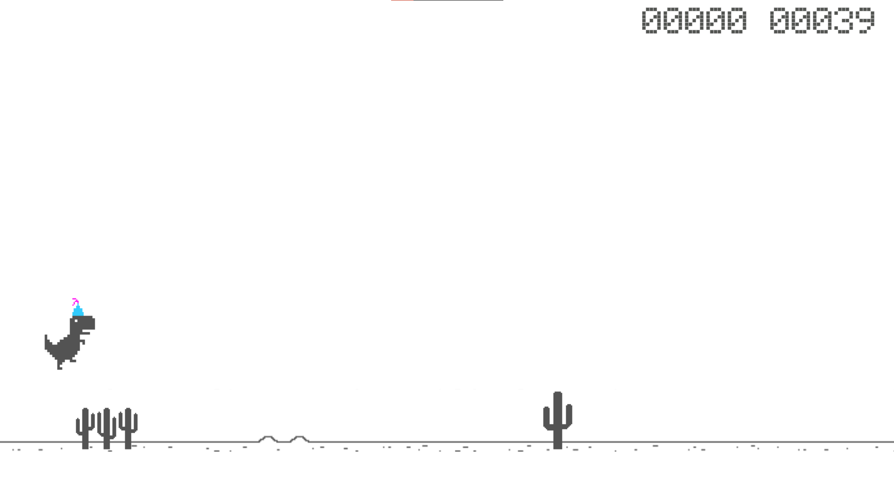
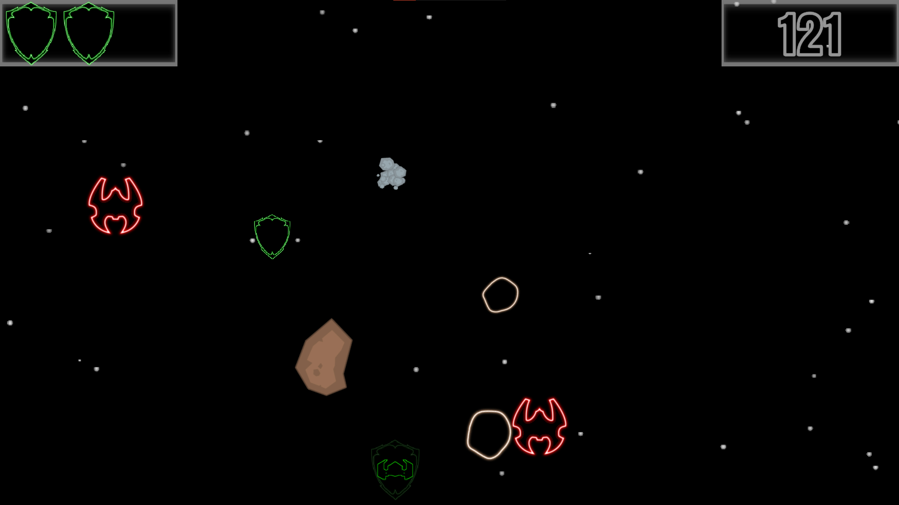
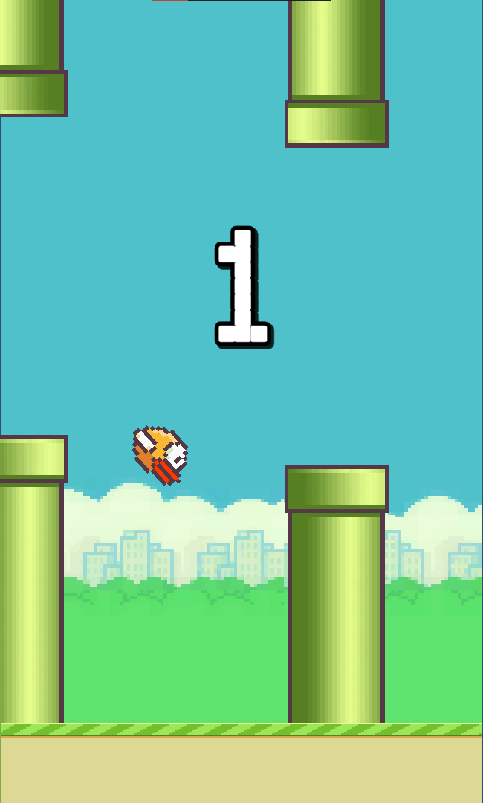
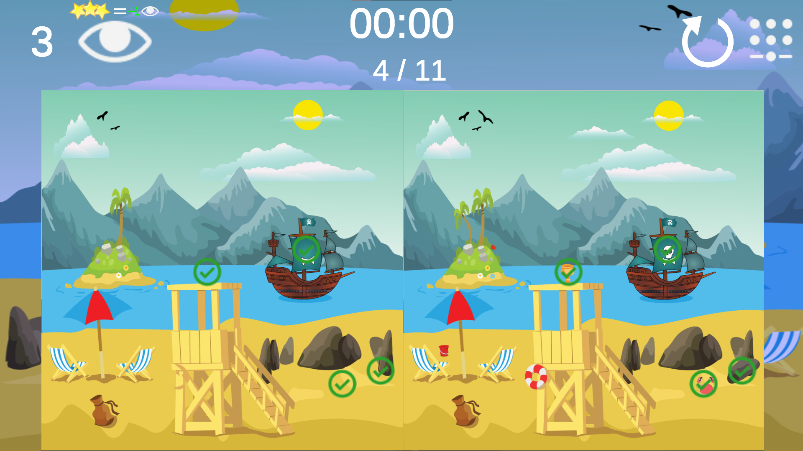

# Mini-Games
Presentation [all games](https://czarny77.github.io/Mini-Games/)

Game list:
- [Dino chrome](https://czarny77.github.io/Mini-Games/DinoWebGL/index.html) 
  A game by all very familiar, type of endless runner without special additions. 
   
  link to the repository: [Link](https://github.com/CZARNY77/Infinity-Runner)
   
   
- [Space Invaders](https://czarny77.github.io/Mini-Games/Space%20InvadersWebGL/index.html) 
  Another game is a combination of space invaders and endless runner, our goal in the game is to fly as long as possible avoiding various obstacles, we can also destroy them by shooting. 
   
  link to the repository: [Link](https://github.com/CZARNY77/Space-Invaders)
   
   
- [Flappy Birds](https://czarny77.github.io/Mini-Games/Flappy%20Birds%20WebGL/index.html) 
  The name speaks for itself about the game, the game may have slight problems on PC with resolution. 
   
  link to the repository: [Link](https://github.com/CZARNY77/Flappy-Bird)
   
   
- [FinDifferences](https://czarny77.github.io/Mini-Games/FinDifferencesWebGL/index.html) 
  The last game is Find the Differences, the game has a very easy system of adding more levels relying on taking data from Streaming Assets, more information in the repository. 
   
  link to the repository: [Link](https://github.com/CZARNY77/Find-Differences)
